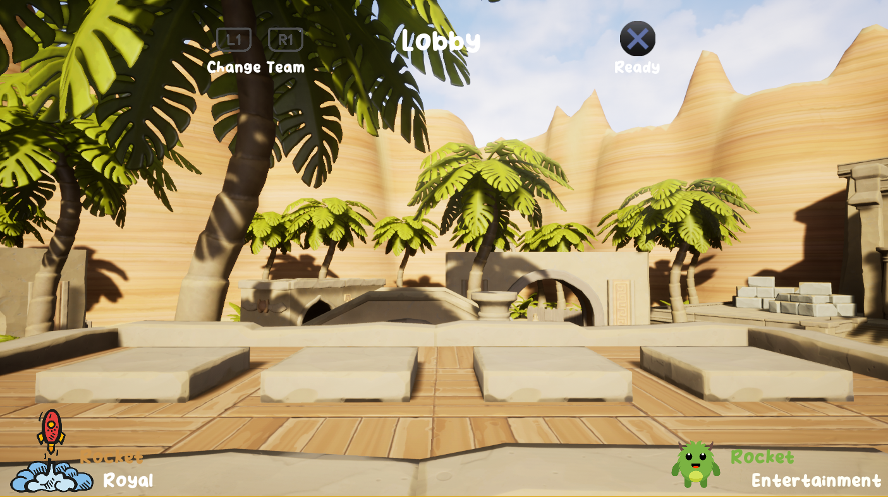
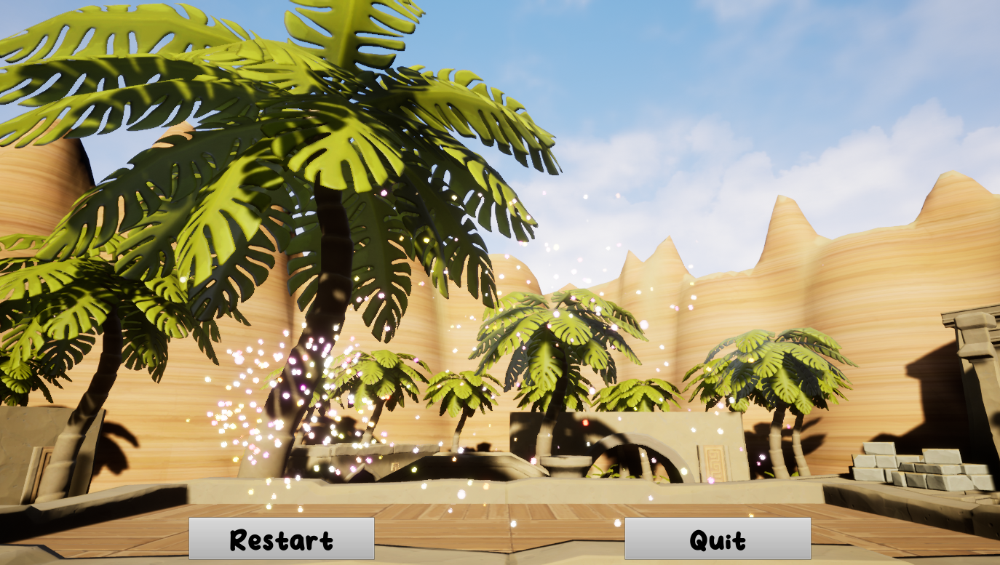
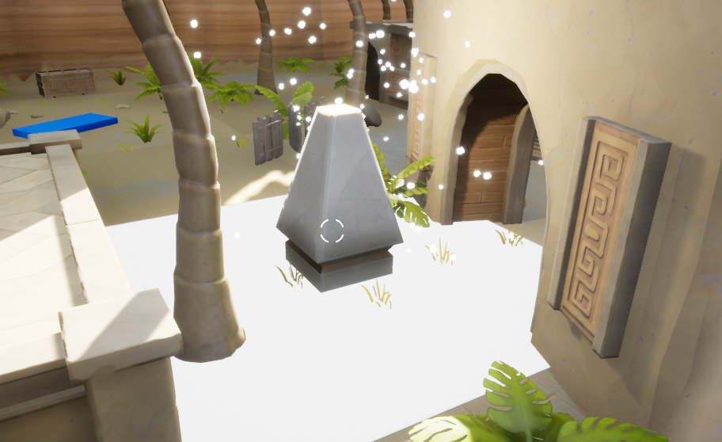
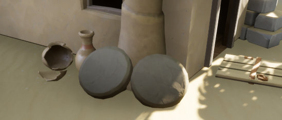
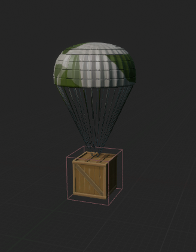
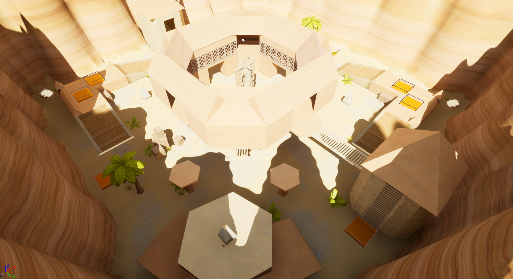
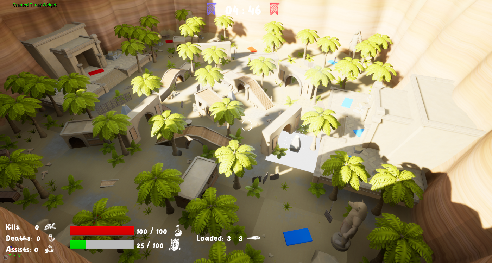
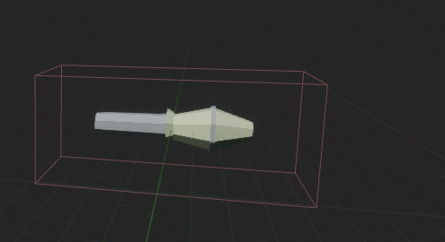
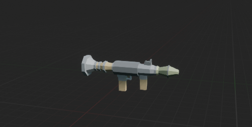

<div align="center">

# Rocket Royal
</div>

**This project aims at creating a 3D third-person game in C++/Blueprint packaged for the PS4 console.**<br/>
**The second goal of this project was to learn how to wok with Playstation Devkits.**

## Information
Project start : 24/11/2022 <br>
Project end : 07/12/2022 <br>
Version : 1.0 - GOLD <br>
Date last version : 07/12/2022

## Bindings PS4
LEFT JOYSTICK -> Movement
SQUARE -> Ultimate
R1 -> Shoot
X -> Ready + Jump
RIGHT JOYSTIK -> Aim


## Bindings PC
W,A,S,D -> Movement

Shift -> Join game
Space - > Ready + Jump
Q - > Change team
E -> Ultimate
RIGHT CLICK -> Shoot

## Building
## Create an executable
```sh
$ UnrealEngine > File > Package Project > Windows (64-bit)
```
## Run
```sh
$ UnrealEngine > Play Button or Start "RocketRoyal.exe"
```
## Game Preview
# LOBBY
-> Close when entering in the arena to prevent player for getting back to safe zone, also protects win entrance
- 
# WIN SCREEN
- 

# CAPTURE ZONE
- 
# BUMPERS
- 
# AIRDROPS
- 

# FIRST MAP
- 
# SECOND MAP
- 

# ROCKET BULLETS
- 

# ROCKET LUNCHERS
- 

## Asset Credits
---------------
- Thank to anyones asset's used on this project!